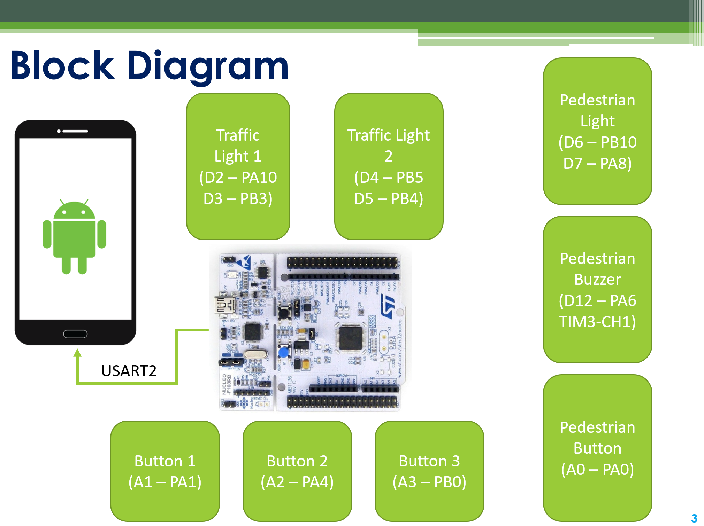

# Assignment Project - Traffic Light using STM32F103RB

## Introduction
In this project, the STM32F103RB is used to simulate the 2-way traffic light system, having some main features:
- **Automatic mode**: The system operates as normal. The light colors are red, yellow, and green.
- **Manual mode**: A button is used to switch the light colors in this mode
- **Tuning mode**: This mode is used to modify the light timing length
- **[Pedestrian scramble](https://en.wikipedia.org/wiki/Pedestrian_scramble)**: when the button for pedestrian is pressed, its light is turned on and operates reversely to the light of vehicles

## Block Diagram

## Truth Table - Traffic Light

| Traffic Light 1 | Traffic Light 2 | Light |
| :------------------: | :------------: | :------------: |
| 1 | 0 | RED |
| 1 | 0 | AMBER |
| 0 | 1 | GREEN |

